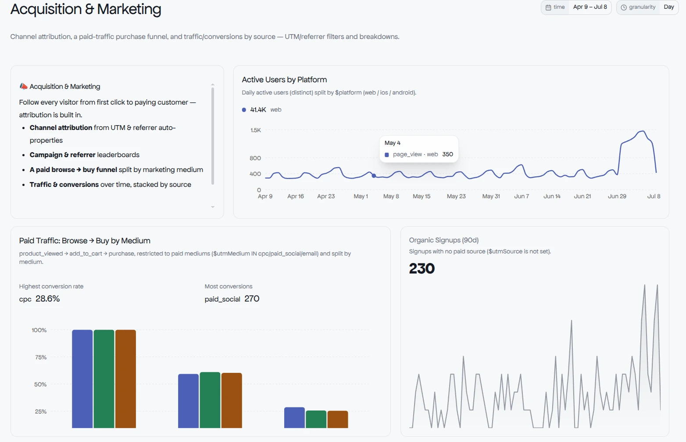
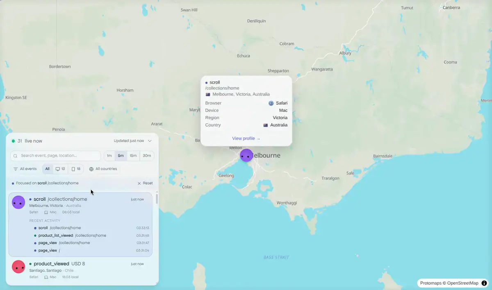
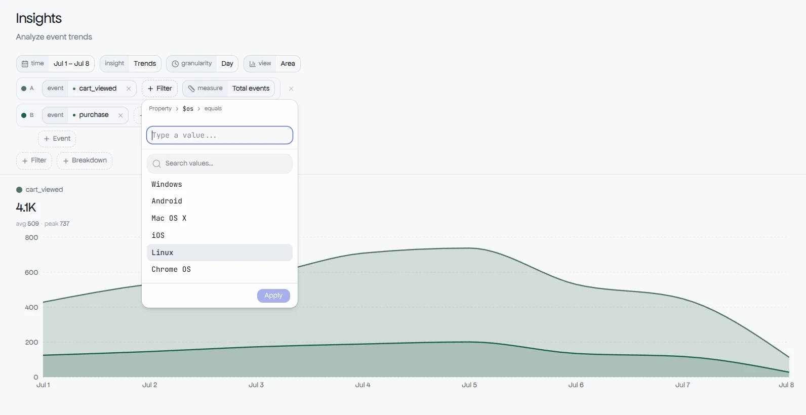
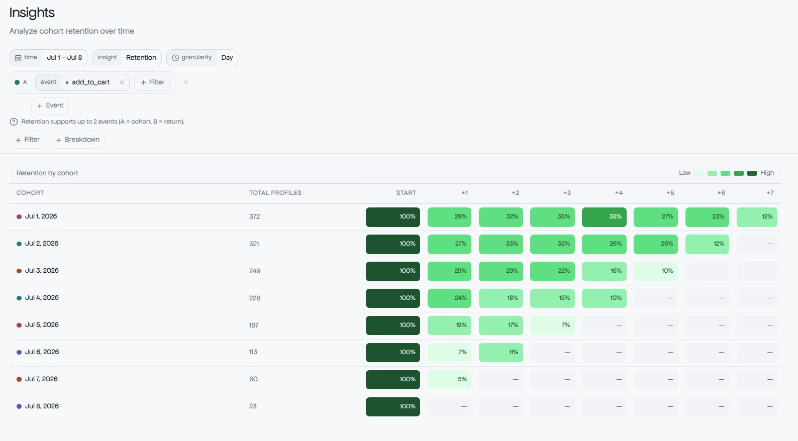
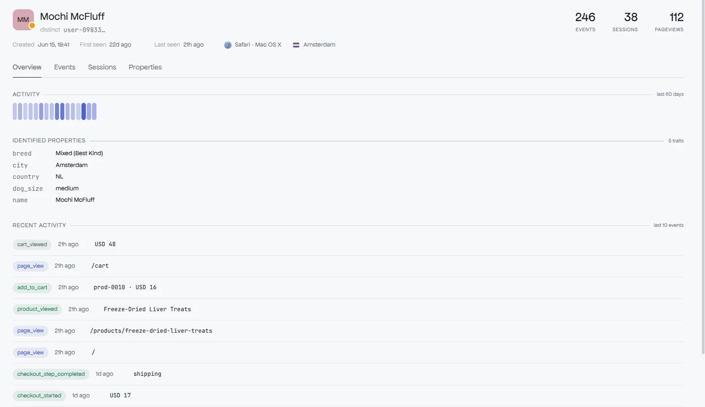
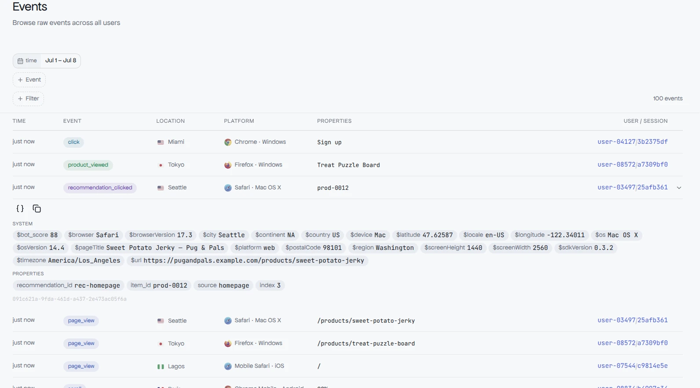

# Pug

[](https://github.com/pug-sh/pug/actions/workflows/ci.yaml)
[](https://codecov.io/gh/pug-sh/pug)
[](https://discord.gg/kDNHDWcBHP)

Pug is an open-source product analytics platform. Capture events, identify the
people behind them, and explore behavior through funnels, retention, trends,
segmentation, and user-flow analysis — all surfaced on customizable dashboards.

Built in Go on PostgreSQL, ClickHouse, and NATS.

## Features

- **Event ingestion** — a NATS-backed capture pipeline with automatic geo,
  user-agent, and bot-detection enrichment.
- **Profiles** — identify and alias the users behind events, with a
  ClickHouse-backed profile and activity API.
- **Insights** — trends, funnels, retention, segmentation, user flow (Sankey),
  and top-K breakdowns, with filtering, breakdowns, and period-over-period
  comparison.
- **Dashboards** — compose insight and markdown tiles on a grid with a
  board-level time window, accelerated by a pre-aggregated rollup fast path.
- **Privacy & compliance** — GDPR/DPDP data-subject erasure of a person's
  events and profile.

<p>
  
  <br /><sub><b>Dashboards</b> — compose insight and markdown tiles on a time-windowed grid.</sub>
</p>

<p>
  
  <br /><sub><b>Live view</b> — every event on a live world map; zoom in for the page, browser, device, and the profile behind it.</sub>
</p>

<p>
  
  <br /><sub><b>Insights</b> — build trends, funnels, retention, and more with filters and breakdowns.</sub>
</p>

<p>
  
  <br /><sub><b>Retention</b> — cohort heatmaps that track how each day's users come back over time.</sub>
</p>

<p>
  
  <br /><sub><b>Profiles</b> — the person behind the events, with traits, sessions, and activity.</sub>
</p>

<p>
  
  <br /><sub><b>Events</b> — inspect the raw stream, enriched with geo, device, and bot signals.</sub>
</p>

## Tech stack

- **Go** — backend services and workers, exposed over [Connect RPC](https://connectrpc.com/) (HTTP/2)
- **PostgreSQL** — relational store (orgs, projects, dashboards, auth)
- **ClickHouse** — analytical store for events, insights, and profiles
- **NATS** — messaging backbone for the ingestion and worker pipelines

## Quick start

```bash
# Build the binary -> bin/pug
make build

# Start dev infrastructure (PostgreSQL, NATS, ClickHouse)
make infra

# Run migrations
./bin/pug postgres migrate
./bin/pug nats migrate
./bin/pug clickhouse migrate

# Start the dev server + workers together
./bin/pug dev
```

Environment variables are documented in [`.env.example`](.env.example).

## Development

```bash
make test    # run tests (race detector enabled)
make cover   # run tests and write coverage.out
make lint    # lint Go code
make sqlc    # regenerate sqlc queries after editing SQL
make rpc     # regenerate protobuf code after editing .proto files
make templ   # regenerate templ email templates
```

## Architecture

Per-subsystem documentation lives in [`docs/architecture/`](docs/architecture/)
(insights, ClickHouse, profiles, ingestion, email, telemetry) and
[`docs/compliance/`](docs/compliance/). Contributor guidance and conventions are
in [`CLAUDE.md`](CLAUDE.md).

## License

Pug is licensed under the [GNU AGPL v3.0](LICENSE).
