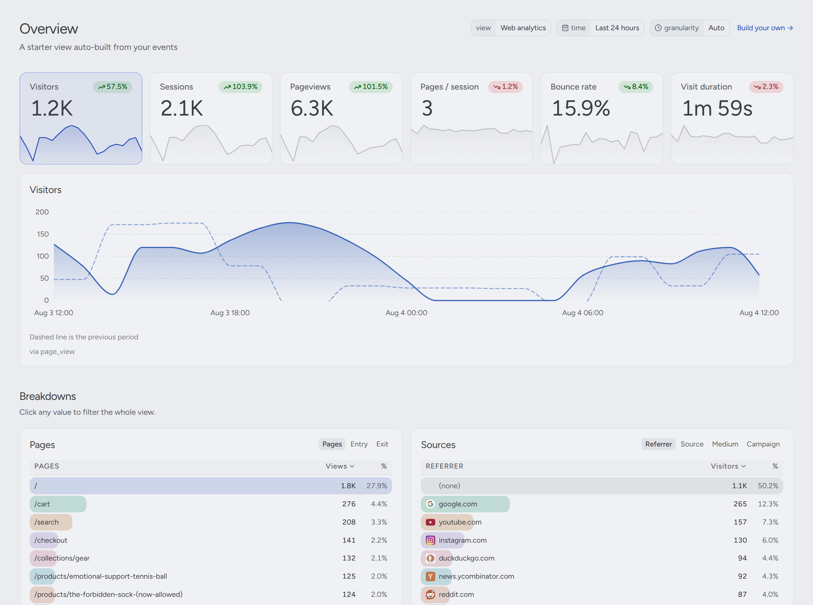
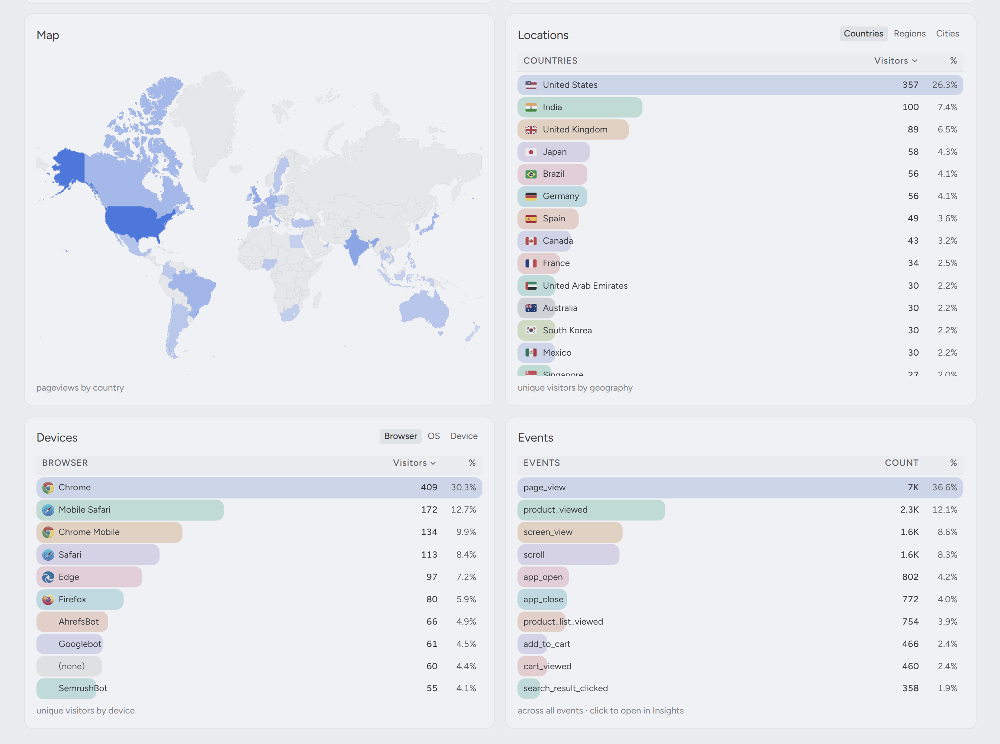
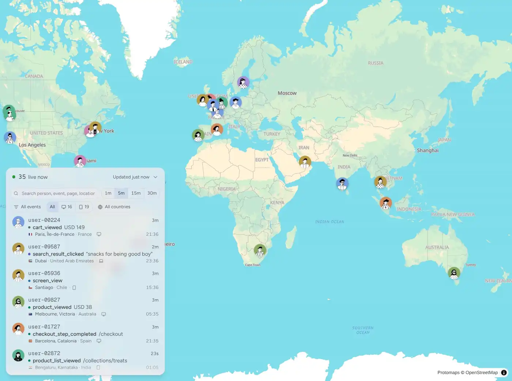
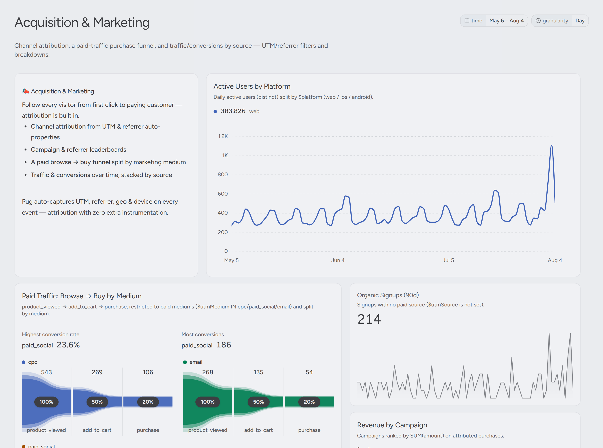
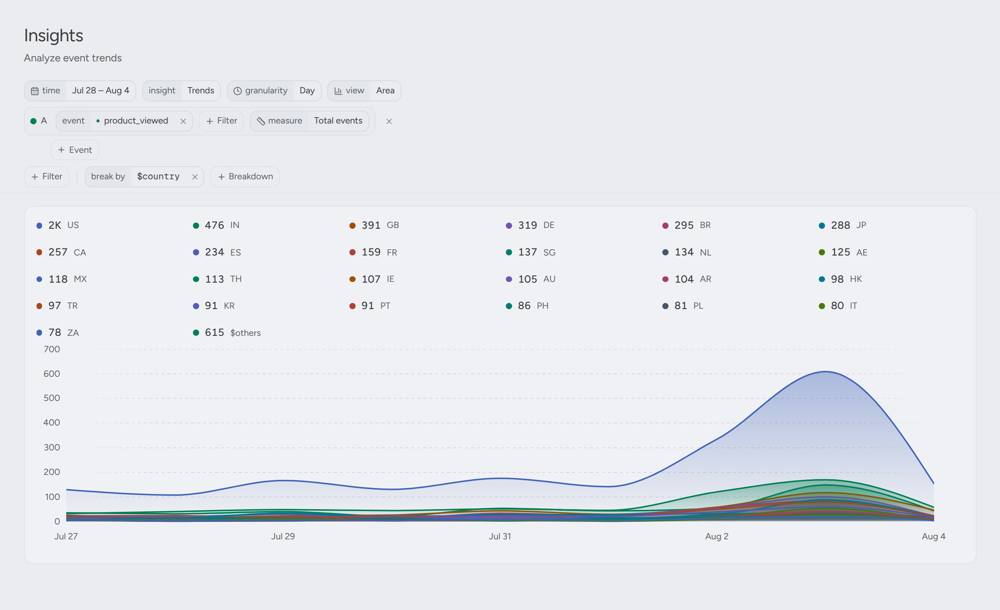
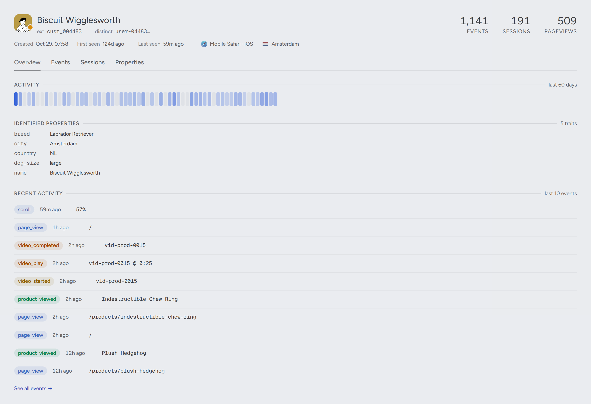

# Pug

[](https://github.com/pug-sh/pug/actions/workflows/ci.yaml)
[](https://codecov.io/gh/pug-sh/pug)
[](https://discord.gg/kDNHDWcBHP)

Pug is an open-source product analytics platform. Capture events, identify the
people behind them, and explore behavior through funnels, retention, trends,
segmentation, and user-flow analysis — all surfaced on customizable dashboards.

Built in Go on PostgreSQL, ClickHouse, and NATS.

## Features

- **Event ingestion** — a NATS-backed capture pipeline with automatic geo,
  user-agent, bot-detection, and web-attribution enrichment.
- **Web analytics** — an overview auto-built from your events: visitors,
  sessions, pageviews, bounce rate, and traffic sources, with no tile to wire up.
- **Live view** — every visitor on a real-time world map, down to the person and
  the event they just fired.
- **Profiles** — identify and alias the users behind events, with a
  ClickHouse-backed profile and activity API.
- **Insights** — trends, funnels, retention, segmentation, user flow (Sankey),
  and top-K breakdowns, with filtering, breakdowns, and period-over-period
  comparison.
- **Dashboards** — compose insight and markdown tiles on a grid with a
  board-level time window, accelerated by a pre-aggregated rollup fast path.
- **Privacy & compliance** — GDPR/DPDP data-subject erasure of a person's
  events and profile.

<p>
  <picture>
    <source media="(prefers-color-scheme: dark)" srcset="docs/assets/overview-dark.webp" />
    
  </picture>
  <br /><sub><b>Overview</b> — a web-analytics view auto-built from your events, with the previous period alongside.</sub>
</p>

<p>
  <picture>
    <source media="(prefers-color-scheme: dark)" srcset="docs/assets/breakdowns-dark.webp" />
    
  </picture>
  <br /><sub><b>Breakdowns</b> — pageviews by country, plus locations, devices, and events; click any value to filter the whole view.</sub>
</p>

<p>
  
  <br /><sub><b>Live view</b> — every visitor on a live world map; click one to fly to them and see the page, device, and profile behind it.</sub>
</p>

<p>
  <picture>
    <source media="(prefers-color-scheme: dark)" srcset="docs/assets/dashboards-dark.webp" />
    
  </picture>
  <br /><sub><b>Dashboards</b> — compose insight and markdown tiles on a time-windowed grid.</sub>
</p>

<p>
  <picture>
    <source media="(prefers-color-scheme: dark)" srcset="docs/assets/insights-dark.webp" />
    
  </picture>
  <br /><sub><b>Insights</b> — trends, filters, and breakdowns; here product views split by country.</sub>
</p>

<p>
  <picture>
    <source media="(prefers-color-scheme: dark)" srcset="docs/assets/profiles-dark.webp" />
    
  </picture>
  <br /><sub><b>Profiles</b> — the person behind the events, with traits, sessions, and activity.</sub>
</p>

## Tech stack

- **Go** — backend services and workers, exposed over [Connect RPC](https://connectrpc.com/) (HTTP/2)
- **PostgreSQL** — relational store (orgs, projects, dashboards, auth)
- **ClickHouse** — analytical store for events, insights, and profiles
- **NATS** — messaging backbone for the ingestion and worker pipelines

## Quick start

```bash
# Build the binary -> bin/pug
make build

# Start dev infrastructure (PostgreSQL, NATS, ClickHouse)
make infra

# Run migrations
./bin/pug postgres migrate
./bin/pug nats migrate
./bin/pug clickhouse migrate

# Seed the demo project with events, profiles, and dashboards
# (resets the local Postgres and ClickHouse databases — see "Demo data" below)
./bin/pug seed

# Start the dev server + workers together
./bin/pug dev
```

Environment variables are documented in [`.env.example`](.env.example).
Google and generic OIDC sign-in are documented in
[`docs/authentication.md`](docs/authentication.md), with a ready-to-copy
[`config.example.json`](config.example.json).

### Demo data

`./bin/pug seed` fills a "Pug & Pals" demo project with ~4 months of history, so
dashboards, insights, and profiles have something to show. Profiles are seeded
only for users that produced events, so the data is internally consistent.

> **Local databases only.** By default `seed` migrates Postgres and ClickHouse
> all the way down and back up, dropping every table — not just the demo rows.
> There is no confirmation prompt and no environment check: it connects to
> whatever `DATABASE_URL` and `CLICKHOUSE_URL` resolve to, and an already
> exported variable beats `.env`. Point it at a disposable local or demo
> database.

Pass `--no-reset` to keep the schema; it then deletes the demo project's own
events and profiles before re-seeding them, leaving other projects untouched.
Volume is tunable with `--count` (default 500,000 events) and `--batch` (default
10,000 events per insert). Run it from the repo root; it reads the same `.env`
as the rest of the CLI.

Two accounts are seeded, both with the password `goodboy`:

- `woof@pug.sh` — org admin
- `snoop@pug.sh` — read-only viewer

For a live stream of traffic instead of a one-shot backfill, set
`PUG_DEMO_ENABLED=true`: `./bin/pug dev` then also runs the demo worker. It
backfills an **empty** project once, so after `pug seed` it skips straight to
playing new sessions out in real time. If you seed with a smaller `--count`,
lower `PUG_DEMO_SEED_COUNT` to match — the worker reads a project holding fewer
events than that as an interrupted backfill and warns rather than topping it up.

## Development

```bash
make test    # run tests (race detector enabled)
make cover   # run tests and write coverage.out
make lint    # lint Go code
make sqlc    # regenerate sqlc queries after editing SQL
make rpc     # regenerate protobuf code after editing .proto files
make templ   # regenerate templ email templates
```

## Architecture

Per-subsystem documentation lives in [`docs/architecture/`](docs/architecture/)
(insights, ClickHouse, profiles, ingestion, email, telemetry). Contributor
guidance and conventions are in [`CLAUDE.md`](CLAUDE.md).

## License

Pug is licensed under the [GNU AGPL v3.0](LICENSE).
